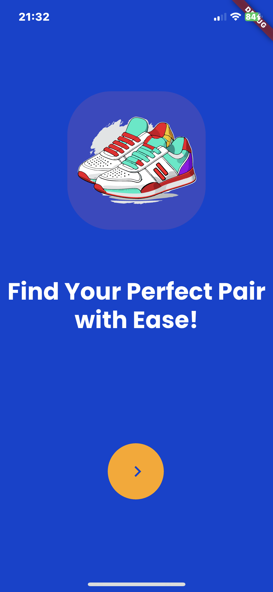
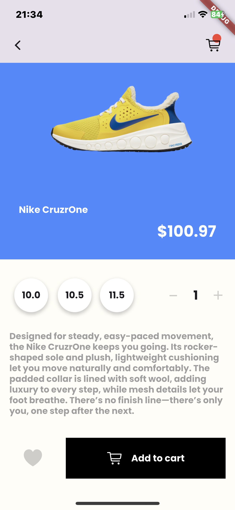

# Sneakers E-Commerce App UI

## Screenshots

 
 

## Video demonstration

https://github.com/user-attachments/assets/cfbf3113-5eb6-4090-b71c-4c714ba74fe2

## Getting Started

A few resources to get you started if this is your first Flutter project:

- [Lab: Write your first Flutter app](https://docs.flutter.dev/get-started/codelab)
- [Cookbook: Useful Flutter samples](https://docs.flutter.dev/cookbook)

For help getting started with Flutter development, view the
[online documentation](https://docs.flutter.dev/), which offers tutorials,
samples, guidance on mobile development, and a full API reference.
