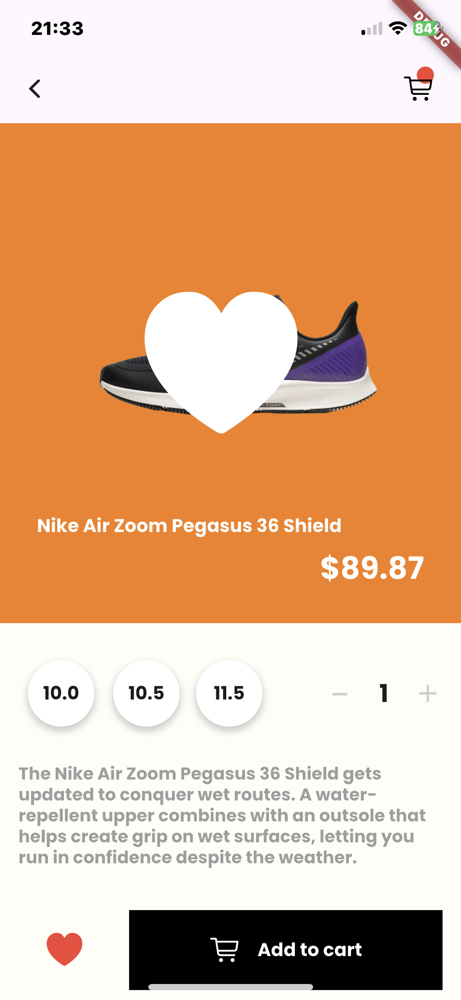

# Sneakers E-Commerce App UI

## Screenshots

 
 

## Video demonstration

<video width="400" controls>
  <source src="assets/read-me/RPReplay_Final1723840545.mp4" type="video/mp4">
  Your browser does not support the video tag.
</video>

## Getting Started

A few resources to get you started if this is your first Flutter project:

- [Lab: Write your first Flutter app](https://docs.flutter.dev/get-started/codelab)
- [Cookbook: Useful Flutter samples](https://docs.flutter.dev/cookbook)

For help getting started with Flutter development, view the
[online documentation](https://docs.flutter.dev/), which offers tutorials,
samples, guidance on mobile development, and a full API reference.
